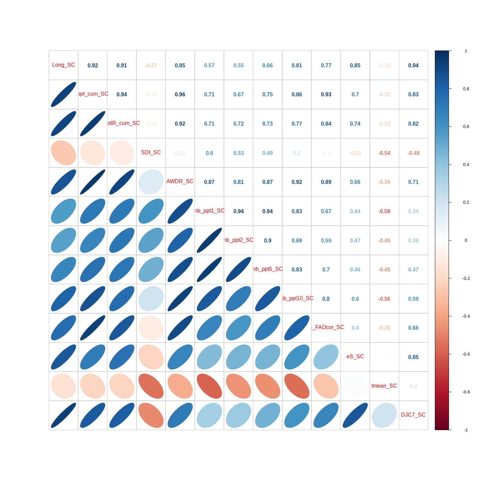
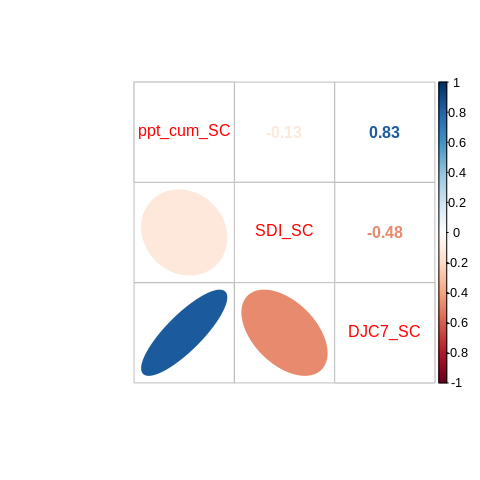
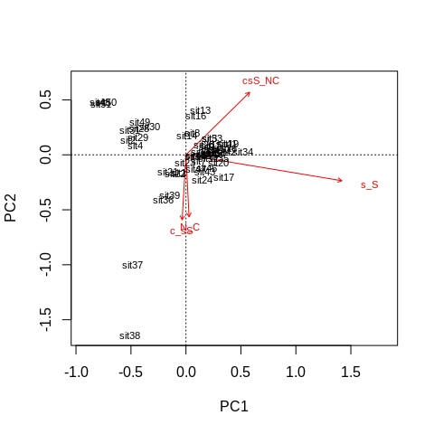
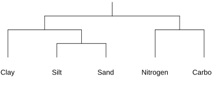
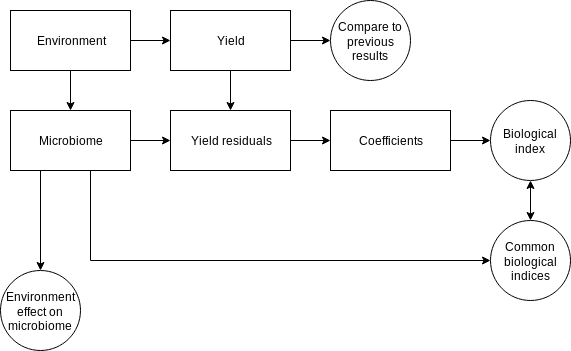
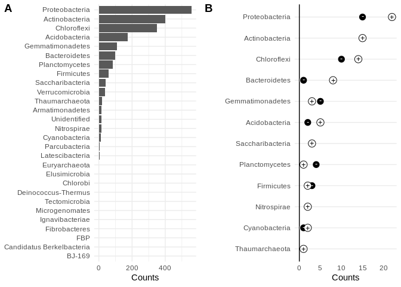
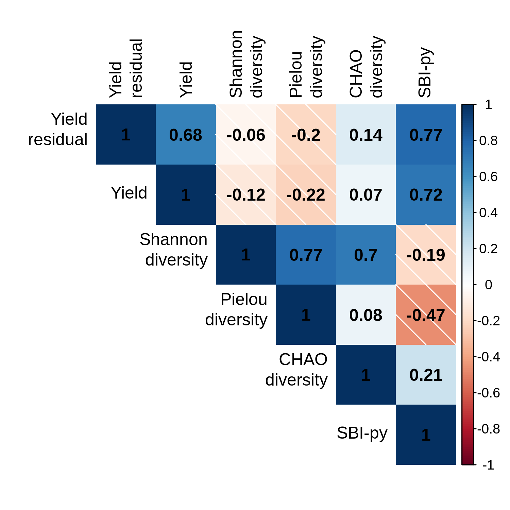
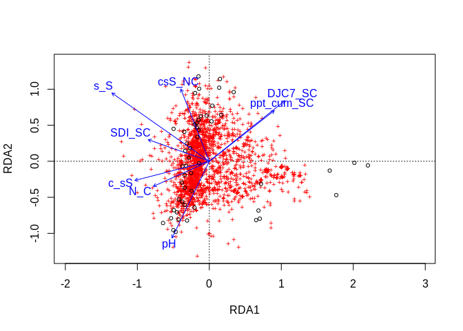
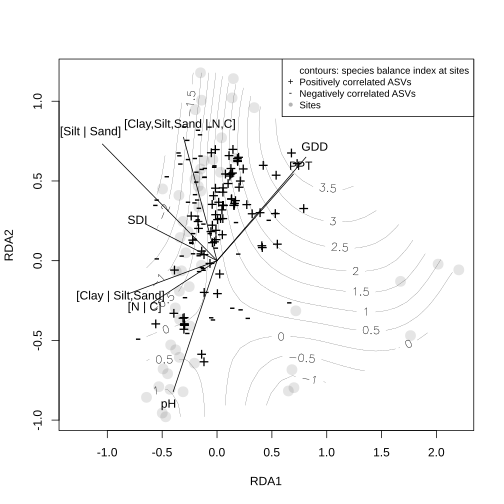

Soil bacterial microbiome - potato
================

# Load libraries

``` r
set.seed(655324) # random.org

library('tidyverse')
library('reshape2')
library('compositions')
library('zCompositions')
library('vegan')
library('GGally')
library('cowplot')
library("corrplot")
```

# Preprocessing data

## Load data

We have two data sets:

  - `metadata` contains site descriptions, weather indices, as well as
    physico-chemical data.
  - `asv_bacteria` contains the ASV counts

The data sets are connected by the sample identifier, which is the
SampleID column. First, metadata.

``` r
metadata <- read_csv('data/metadata_qiime2_V3V4.csv', na = c('n/a'))
```

Then the ASV dataset. Here we select the dataset among the unfiltered
one (`nofilter`), the filter with at least 10 observed counts
(`filter10`) and the filter with ASV occuring at least in two
observations (`contingency2`).

``` r
tables <- c("nofilter", "filter10", "contingency2")
selected_table <- 3

asv_bacteria <- read_tsv(paste0("data/table-bacteria-", tables[selected_table], ".txt"))
phylum <- read_tsv(paste0("data/taxonomy-", tables[selected_table], ".txt"))
phylum$phylum[is.na(phylum$phylum)] <- "Unidentified"
names(phylum)[1] <- "asv"

asv_mat <- asv_bacteria %>% dplyr::select(-SampleID)
paste("Proportion of zeros in the asv table:", round(sum(asv_mat == 0) / (ncol(asv_mat) * nrow(asv_mat)), 3) * 100, "%")
```

    ## [1] "Proportion of zeros in the asv table: 85.7 %"

## Weather

We computed several weather indices. The column names of these indices
are stored in a
list.

``` r
all_SC_climate_variables <- c("Long_SC", "ppt_cum_SC", "pptIR_cum_SC" ,"SDI_SC",
                              "AWDR_SC", "nb_ppt1_SC", "nb_ppt2_SC", "nb_ppt5_SC",
                              "nb_ppt10_SC", "Ih_FAOcor_SC", "eS_SC",
                              "tmean_SC", "DJC7_SC")
```

These indices are numerous and redundant, as shown by the following
pairs plot.

``` r
metadata %>% 
  group_by(num_champ) %>% 
  dplyr::select(one_of(c('num_champ', all_SC_climate_variables))) %>%
  summarise_all(funs(mean)) %>%
  dplyr::select(-num_champ) %>%
  cor(.) %>%
  corrplot.mixed(., lower='ellipse', upper='number')
```

    ## Warning: funs() is soft deprecated as of dplyr 0.8.0
    ## please use list() instead
    ## 
    ## # Before:
    ## funs(name = f(.)
    ## 
    ## # After: 
    ## list(name = ~f(.))
    ## This warning is displayed once per session.

<!-- -->

Weather indices are highly colinear. The mean temperature (`tmean_SC`)
is poorly correlated with degree days (`DJC7_SC`), but degree days are
highly correlated with comulated precipitations (`ppt_cum_SC`). The
dataset is probably too small to infer colinearity. With a large
dataset, [Parent et al.
(2017)](https://doi.org/10.3389/fenvs.2017.00081) removed some indices
based on the colinearty and kept cumulated precipitations, Shannon
diversity index of precipitations and degree days.

``` r
prune1_SC_climate_variables <- c("ppt_cum_SC", "SDI_SC", "DJC7_SC") # 

metadata %>% 
  group_by(num_champ) %>% 
  dplyr::select(one_of(c('num_champ', prune1_SC_climate_variables))) %>%
  summarise_all(funs(mean)) %>%
  dplyr::select(one_of(prune1_SC_climate_variables)) %>%
  cor(.) %>%
  corrplot.mixed(., lower='ellipse', upper='number')
```

<!-- -->

The following weather indices are selected for continuation.

``` r
climate_variables <- c('SDI_SC', 'ppt_cum_SC', 'DJC7_SC')
```

## Preprocesing soil compositions

Soil components are preprocessed using isometric log-ratios. As first
step, I put sand, silt, clay, soil carbon and soil nitrogen on the same
common scale.

``` r
texture_variables <- c('pourc_sable', 'pourc_limon', 'pourc_argile')
texture_mineral <- metadata[, texture_variables]/apply(metadata[, texture_variables], 1, sum) * 100
texture_tot <- texture_mineral * (100 - metadata$C_tot - metadata$N_tot)/100
soil_tot <- cbind(texture_tot, metadata$C_tot, metadata$N_tot)
```

The `soil_tot` data frame is my simplex. I structure balances in such a
way that it makes sense for interpretation purposes. I fist balance
organic (N and C) with mineral (sand, silt and clay). Then sand and silt
are balanced with clay. Last two balances are obvious: sand and silt,
then carbon and nitrogen. The warnings are due to now deprecated
functions in R which are still used in the package `compositions`, whose
last update came in 2014.

``` r
soil_sbp <- matrix(c(-1,-1,-1, 1, 1,
                     1, 1,-1, 0, 0,
                     1,-1, 0, 0, 0,
                     0, 0, 0, 1,-1),
                   byrow=TRUE, ncol=5)
soil_bal <- ilr(soil_tot, V=gsi.buildilrBase(t(soil_sbp)))
ilrDef_long <- c('[Clay,Silt,Sand | N,C]',
                 '[Clay | Silt,Sand]',
                 '[Silt | Sand]',
                 '[N | C]')
ilrDef_short <- c('csS_NC', 'c_sS', 's_S', 'N_C')
colnames(soil_bal) <- ilrDef_short

soil_pca <- soil_bal %>% 
  rda()
biplot(soil_pca)
```

<!-- -->

``` r
metadata <- cbind(metadata, soil_bal)
```

``` r
source("https://raw.githubusercontent.com/essicolo/AgFun/master/codadend2.R")
comp_dummy <- matrix(1L, nrow = 5, ncol = ncol(soil_tot))
colnames(comp_dummy) <- c('Sand', 'Silt', 'Clay', 'Carbon', 'Nitrogen')
svg("images/codadend_schema.svg", width = 5, height = 2)
par(mar = c(3, 0, 0, 0))
CoDaDendrogram2(comp_dummy, V = gsi.buildilrBase(t(soil_sbp)), show.range = F, equal.height = TRUE, leaf_las = 1)
dev.off()
```

    ## png 
    ##   2



## Merge metadata and ASVs

``` r
metadata_asvbac <- left_join(metadata, asv_bacteria, by='SampleID')
asv_bacteria_o <- metadata_asvbac %>% dplyr::select(starts_with('OTU')) # only bacteria counts
```

# Analysis schema

The analysis will be performed to acheive the following schema (schema
done with draw.io).



# Regress yield with environmental variables

This is step 1 in the analysis schema. To do so, I will use a linear
model. This allows to detect effects considering the experiments as
random effects. But first I define the environmental variables in a
list.

``` r
env_variables <- c('pH', ilrDef_short, climate_variables) # , 'densite0.20', 'densite20.40'
```

In order to compare slopes, descriptive data must be
scaled.

``` r
env_df_sc <- data.frame(base::scale(metadata_asvbac[, env_variables], center = TRUE, scale = TRUE))
env_df_sc$rendement <- metadata_asvbac$rendement
```

To obtain the residuals, I conduct a simple frequentist linear
regression.

``` r
formula_y.env <- as.formula(paste('rendement ~ ', paste(env_variables, collapse = ' + ')))
lm_y.env <- lm(formula_y.env, data=env_df_sc) # names(metadata_asvbac)
summary(lm_y.env)
```

    ## 
    ## Call:
    ## lm(formula = formula_y.env, data = env_df_sc)
    ## 
    ## Residuals:
    ##      Min       1Q   Median       3Q      Max 
    ## -14.8889  -5.2918   0.1049   5.7725  19.3909 
    ## 
    ## Coefficients:
    ##             Estimate Std. Error t value Pr(>|t|)    
    ## (Intercept) 34.58600    1.14261  30.269  < 2e-16 ***
    ## pH          -0.02423    1.26401  -0.019  0.98480    
    ## csS_NC       1.78067    2.02433   0.880  0.38406    
    ## c_sS        -5.63099    1.92416  -2.926  0.00551 ** 
    ## s_S         -8.36134    1.74481  -4.792 2.08e-05 ***
    ## N_C          1.42806    1.88885   0.756  0.45384    
    ## SDI_SC       3.87468    2.37689   1.630  0.11055    
    ## ppt_cum_SC  -5.82503    3.63813  -1.601  0.11685    
    ## DJC7_SC      6.54846    3.62685   1.806  0.07816 .  
    ## ---
    ## Signif. codes:  0 '***' 0.001 '**' 0.01 '*' 0.05 '.' 0.1 ' ' 1
    ## 
    ## Residual standard error: 8.16 on 42 degrees of freedom
    ## Multiple R-squared:  0.5393, Adjusted R-squared:  0.4515 
    ## F-statistic: 6.145 on 8 and 42 DF,  p-value: 3.056e-05

There is a lot of variance in the model. Yield is a function of many
variables, I only have few of them, and their is few data. Coefficients
are shown in the following plot.

``` r
lm_y.env_df <- data.frame(summary(lm_y.env)$coefficients)
lm_y.env_df$descr <- as.factor(c("Intercept", "pH", "[Clay,Silt,Sand | N,C]", 
                                 "[Clay | Silt,Sand]", "[Silt | Sand]", "[N | C]",
                                 "SDI", "PPT", "GDD"))
lm_y.env_df$descr <- factor(lm_y.env_df$descr, levels = lm_y.env_df$descr)
lm_y.env_df$is_significant <- factor(ifelse(lm_y.env_df$Pr...t.. <= 0.05, "significant", "not significant"))
rownames(lm_y.env_df) <- 1:nrow(lm_y.env_df)
lm_y.env_df <- cbind(lm_y.env_df, confint(lm_y.env, level = 0.95))

ggplot(lm_y.env_df[-1, ], aes(x=Estimate, y=descr)) +
  geom_vline(xintercept = 0, linetype = 2) +
  geom_errorbarh(aes(xmin = `2.5 %`, xmax = `97.5 %`), height = .2) +
  geom_point(aes(fill=is_significant), size=3, shape=21) +
  scale_fill_manual(values = c('black', 'white')) +
  guides(fill=guide_legend(title=" ")) +
  theme(legend.position="bottom") +
  xlab("Coefficient of scaled variable") +
  ylab("")
```

<!-- -->

``` r
ggsave('images/lm-coefficients.png', dpi=300, width=8, height=5)
```

# Biological health index

I extract the residuals to proceed to the next analysis, between yield
residuals and microbiome.

``` r
y_res = residuals(lm_y.env)
```

It is assumed that the residuals is the fraction of the variation of
yield which is not explained by environmental variables. This
unexplained variation can be correlated with ASVs.

## Preprocess ASVs to clrs

To transform ASVs to clr, we must impute zeros with *pseudo-counts*. The
following code chunk realls the percentage of
zeros.

``` r
paste("Proportion of zeros in the asv table:", round(sum(asv_bacteria_o == 0) / (ncol(asv_bacteria_o) * nrow(asv_bacteria_o)), 3) * 100, "%")
```

    ## [1] "Proportion of zeros in the asv table: 85.7 %"

Zero replacement can be done using bayesian-multiplicative replacements
with the `zCompositions`
package.

``` r
asv_bacteria_o_pc <- zCompositions::cmultRepl(X = asv_bacteria_o, label = 0, method="CZM", output = "p-counts")
```

Then we create clrs.

``` r
geomean <- function(x) exp(mean(log(x)))
asv_bacteria_comp <- apply(asv_bacteria_o_pc, 1, function(x) x/sum(x))
asv_bacteria_clr <- apply(asv_bacteria_comp, 1, function(x) log(x/geomean(x)))
```

## Correlation with `y_res`

``` r
cor_bact_rdt <- data.frame(asv = colnames(asv_bacteria_clr), cor_rdt = NA, cor_rdt_pval=NA)
for (i in 1:ncol(asv_bacteria_clr)) {
  cor_i <- cor.test(x=asv_bacteria_clr[, i], y=y_res) #metadata_asvbac$rendement # y_res
  cor_bact_rdt$cor_rdt[i] <- cor_i$estimate
  cor_bact_rdt$cor_rdt_pval[i] <- cor_i$p.value
}
```

At this stage, the `cor_bact_rdt` data frame is merged to a phylum
table.

``` r
cor_bact_rdt <- left_join(cor_bact_rdt, phylum, by='asv')
```

    ## Warning: Column `asv` joining factor and character vector, coercing into
    ## character vector

We can arbitrarily cut the p-values to filter in ASVs which are
significantly correlated to `y_res`.

``` r
correlation_pval_delimiter = 0.05
cor_bact_rdt$cor_pval_class <- cut(cor_bact_rdt$cor_rdt_pval, c(0, correlation_pval_delimiter, 1))
levels(cor_bact_rdt$cor_pval_class) <- c('Significant', 'Not significant')
cor_bact_rdt$index_class <- 'Neutral'
cor_bact_rdt$index_class[cor_bact_rdt$cor_pval_class == 'Significant' & cor_bact_rdt$cor_rdt < 0] <- 'Negative'
cor_bact_rdt$index_class[cor_bact_rdt$cor_pval_class == 'Significant' & cor_bact_rdt$cor_rdt > 0] <- 'Positive'
```

Number of positively and negatively correlated ASV per phylum.

``` r
phylum_nASV <- cor_bact_rdt %>%
  group_by(index_class, phylum) %>%
  count() %>%
  tidyr::spread(key=index_class, value=n) %>%
  mutate_if(is.numeric, funs(replace(., is.na(.), 0))) %>%
  mutate(n_ASV = Negative+Positive) %>%
  dplyr::select(phylum, n_ASV)
```

    ## `mutate_if()` ignored the following grouping variables:
    ## Column `phylum`

Counts of ASVs per phylum (positive and negative counts may
superimpose).

``` r
gg_pos_neg <- cor_bact_rdt %>%
  group_by(index_class, phylum) %>%
  count() %>%
  filter(index_class != 'Neutral') %>%
  left_join(phylum_nASV, by="phylum") %>%
  filter(n_ASV > 1) %>%
  ggplot(aes(y=reorder(phylum, n), x=n)) +
  geom_vline(xintercept=0) +
  #geom_jitter(aes(fill=index_class, colour=index_class), shape=21, size=4, height=0.5, width=0) +
  geom_point(aes(fill=index_class, colour=index_class), shape=21, size=4) +  
  geom_point(aes(colour=index_class, shape=index_class), size=3) +
  xlab('Counts') +
  scale_shape_manual(values=c(45, 43)) +
  scale_fill_manual(values=c('black', 'white')) +
  scale_colour_manual(values=c('white', 'black')) +
  theme_minimal() +
  theme(panel.grid.minor.x = element_blank(),
        panel.grid.major.x = element_blank(),
        legend.position = 'none',
        axis.title.y = element_blank())
```

``` r
gg_all_bact <- cor_bact_rdt %>%
  group_by(phylum) %>%
  count() %>%
  filter(n >= 1) %>%
  ggplot(aes(x=reorder(phylum, n), y=n)) +
  geom_bar(stat='identity') +
  ylab('Counts') +
  theme_minimal() +
  theme(axis.title.y = element_blank()) +
  coord_flip()
```

Both plots are combined. The resulting plot must be edited with Inkscape
where positive and negative counts do superimpose.

``` r
gg_AB <- plot_grid(gg_all_bact, gg_pos_neg, labels='AUTO', align='v')
save_plot('images/phylum.svg', gg_AB, base_height = 5, base_aspect_ratio=2)
gg_AB
```

<!-- -->

The index is computed as the balance between positively correlated and
negatively correlated ASVs.

``` r
species_pos <- cor_bact_rdt$asv[cor_bact_rdt$index_class == 'Positive']
species_neg <- cor_bact_rdt$asv[cor_bact_rdt$index_class == 'Negative']
species_other <- cor_bact_rdt$asv[cor_bact_rdt$index_class == 'Neutral']
round(sum(asv_bacteria_o_pc[1, ][species_pos]))
```

    ## [1] 646

``` r
round(sum(asv_bacteria_o_pc[1, ][species_neg]))
```

    ## [1] 129

``` r
species_balance_index <- apply(asv_bacteria_o_pc, 1, function(x) log(sum(x[species_pos]) / sum(x[species_neg])))
```

``` r
indices_df <- cbind(y_res, metadata_asvbac[, c("rendement", "Shannon-emp", "pielou_e-emp", "chao1-emp")],
                    species_balance_index)
names(indices_df) <- c("Yield\nresidual", "Yield", "Shannon\ndiversity", "Pielou\ndiversity",
                       "CHAO\ndiversity", "SBI-py")
```

This index can be compared to y\_res (yield rsiduals), yield and to
other indices. A publishable plot with `corrplot`.

``` r
library(corrplot)
png('images/paired_indices.png', width=1500, height=1500, res = 300)
corrplot(cor(indices_df), type="upper", tl.col="black", addCoef.col="black", method = "shade")
dev.off()
```

    ## png 
    ##   2



# RDA

``` r
rda_ <- rda(X=asv_bacteria_clr, Y=metadata_asvbac[, env_variables], scale = TRUE)
rda_op <- ordiplot(rda_, scaling=1)
```

<!-- -->

``` r
rda_scaling <- 1
env_scale <- attributes(rda_op$biplot)$const / 3
rda_sf <- ordisurf(rda_ ~ species_balance_index, plot = FALSE, scaling = rda_scaling)
site_scores <- rda_op$sites
species_scores <- rda_op$species
env_scores <- rda_op$biplot * env_scale
rownames(env_scores)[2:5] <- ilrDef_long
rownames(env_scores)[6:8] <- c("SDI", "PPT", "GDD")

svg('images/rda.svg', height=7, width=7)
plot(site_scores, pch=1, col=rgb(0, 0, 0, 0.5), type='n', xlim=c(-1.3, 2.2))
plot(rda_sf, col = 'black', lwd.cl=0.2, labcex = 1, add = TRUE, bubble = T)
segments(x0=0, y0=0, x1 = env_scores[, 1], y1 = env_scores[, 2])
text(x = env_scores[, 1]*1.1, y = env_scores[, 2]*1.1, labels = rownames(env_scores))

# sites
points(site_scores, pch=16, cex=2, col=rgb(0, 0, 0, 0.1))

# scores unclassified species
## points(species_scores[rownames(species_scores) %in% species_other, ], pch=4, cex=0.5, col=rgb(0, 0, 0, 0.07))

# scores of positive species
points(species_scores[rownames(species_scores) %in% species_pos, ], pch='+', cex=1.5, col='black')

# scores of negative species
points(species_scores[rownames(species_scores) %in% species_neg, ], pch='-', cex=1.5, col='black')

# legend
legend(legend = c("contours: species balance index at sites", 
                  "Positively correlated ASVs", 
                  "Negatively correlated ASVs", 
                  #"Neutral ASVs", 
                  "Sites"),
       cex = 0.8,
       col = c(NA, 'black', 'black', 
               #'black', 
               'gray70'), 
       pch = c(NA, '+', '-',
               #'x',
               '●'), 
       x="topright")
dev.off()
```

    ## png 
    ##   2


